# Documentation of the Project  [](https://github.com/sindresorhus/awesome#readme)
> A very simple web based note taker app.


<br />
<p align="center">
    
  </p>

  <h3 align="center">NoteTaker App</h3>


  <!-- TABLE OF CONTENTS -->
  <details open="open">
    <summary>Table of Contents</summary>
    <ol>
      <li>
        <a href="#about-the-project">About The Project</a>
      </li>
      <li><a href="#built-with">Built With</a></li>
      <li><a href="#getting-started">Getting started</a></li>
    </ol>
  </details>


## About the Project

We are gonna make a basic web based notetaker app that will perform basic CRUD operation. We are gonna use hibernate to handle the database and as database we will be using MYSQL.

## Built With

The project will be built with:

1. Hibernate
2. MYSQL
3. Java Spring
4. Servelet
5. JSP etc

## Getting started

1. First step is to start a maven project for simplicity of injecting dependencies. For archetype we have selected `maven-archetype-webapp`.
2. Then we update the library.

      * first we update the jdk

        ***Right Click on project -> Build path -> Configure Build path -> Add library -> JRE System Library -> next-> Default workstation Library (JDK - 15) -> finish***

        <p align="center">
            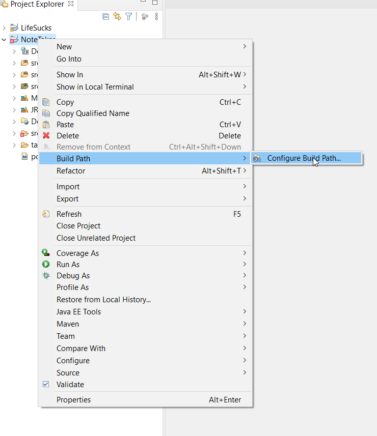
              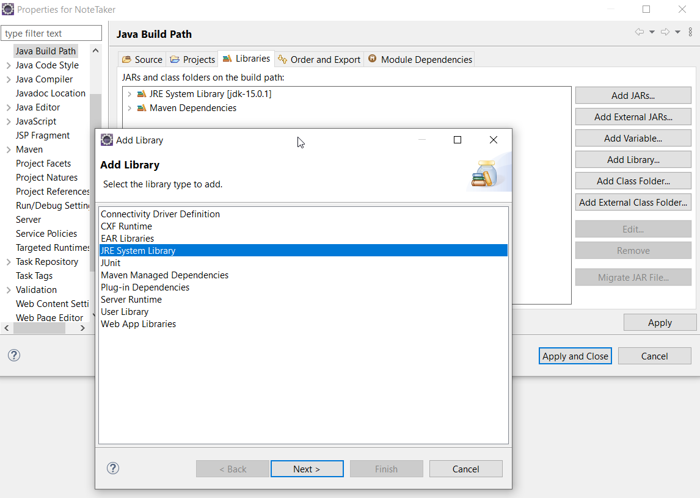
          </p>
      * Then we remove the old J2SE-1.5 (default JRE system library)
        Similarly now we add tomcat server to our project.

        ***Right Click on project -> Build path -> Configure Build path -> Add library -> Server Runtime -> next-> Tomcat -> finish***

        But since we did not have tomcat server downloaded we had to download it first and then add it. The installation of tomcat and adding it to eclipse guide can be found [here]( https://www.eclipse.org/webtools/jst/components/ws/1.0/tutorials/InstallTomcat/InstallTomcat.html#:~:text=Start%20the%20Eclipse%20WTP%20workbench,under%20Apache%20(Apache%20Tomcat%20v5. )

        Now we check if our project is working. To do that, we ***right click project -> run as -> run on server -> apahe tomcat -> finish***

        <p align="center">
            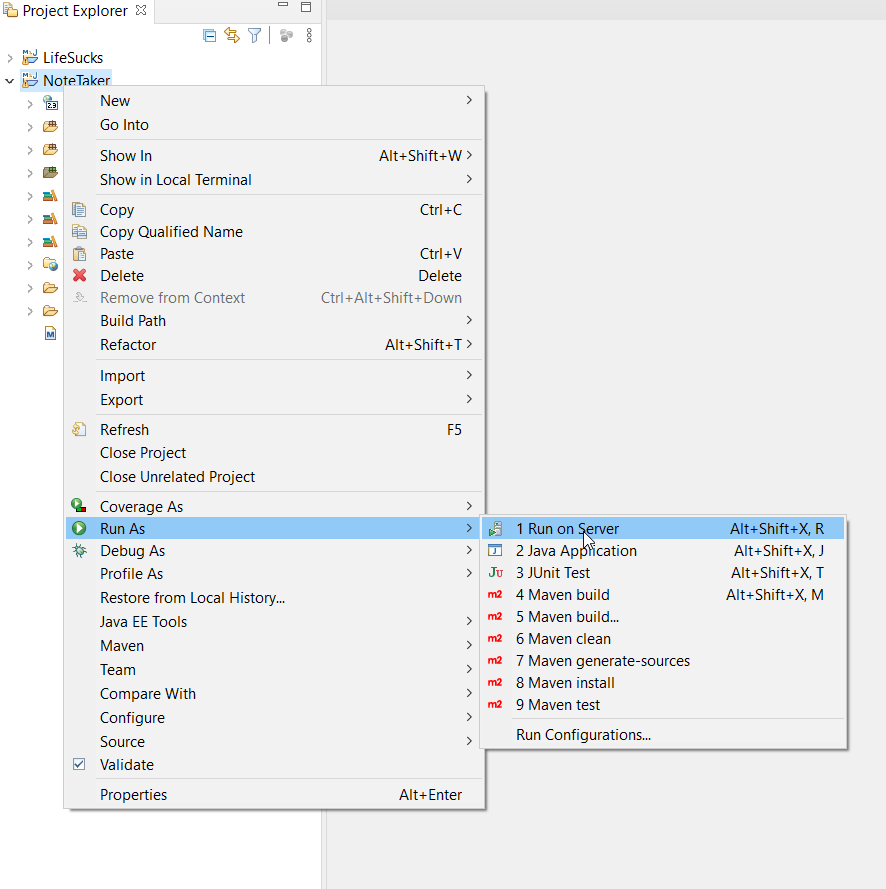
              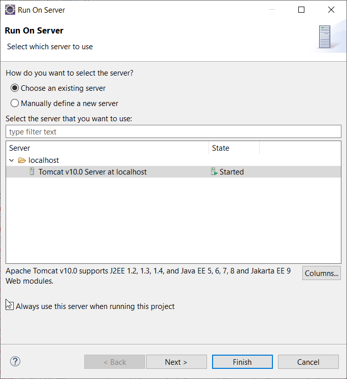
          </p>

        And we see a successful hello world message, which should tell us that our app is good to go.  
        <p align="center">
        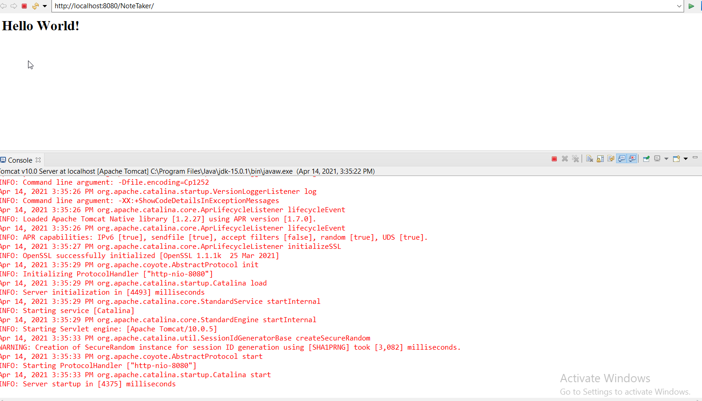
        </p>

## Adding Bootstrap

Now we add some bootstrap to our project. We copy & paste the html code from _getting started -> starter template_ from [getbootstrap.com]( https://getbootstrap.com ) to our index.jsp file.

<p align="center">
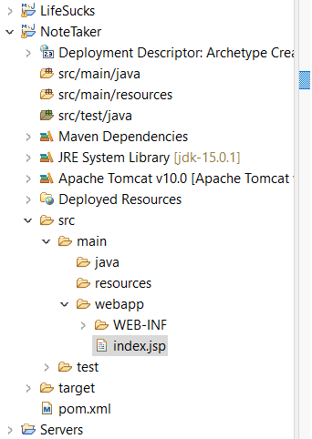
</p>

Now we can see our hello world is much more beautiful now.

## Configuring Project

* Now we configure our hibernate.cfg.xml file and put it in our _src/main/resources_ directory. For now we used our old hibernate project's cfg.xml file and edit it a little.
* Then we edit our dependency file (pom.xml) accordingly. We copy the dependency code for hibernate and mysql from our old hibernate project (or from google) and paste it.
* Then we go ***right click on project -> maven -> update project*** to instigate the change in our dependency file (pom.xml). Maven should now download necessary dependencies. We can see the downloaded jar files by maven in _./Maven Dependencies/_ directory in our project.


## Adding Entities and SingleTone

We start by creating class "Note" in src/main/java folder and keep it in a package "com.entities" for tidiness.

We add necessary properties to it and then edit hibernate.cfg file for mapping the class.

Then we create a class "FacotryProvider" in "com.helper" package (src/main/java directory) for getting a  factory object that maintains single-tone design pattern.


## Adding Navigation Bar

Now we will try to add a navigation bar in our webpage. First we create **navbar.jsp** file in the same directory as **index.jsp** (_Deployed Resources/WebApp/_) . Then we go to bootstrap webpage (link above) and search navbar and copy a suitable navbar code (we chose the first one)

<p align="center">
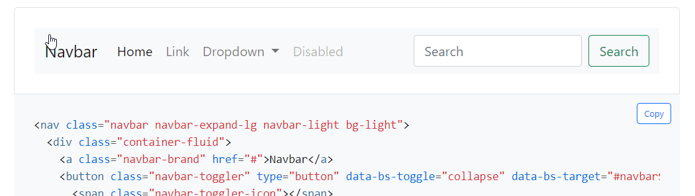
</p>

Then we copy & paste the code in **navbar.jsp** file. After that, we add the navbar in **index.jsp** file by the following snippet of code.

```html
<div class="container">
		<%@include file="navbar.jsp"%>
</div>
```

## Adding CSS

We create a folder "css" in the **index.jsp** file directory and create a css file for our code and include it in our **index.jsp** with the following snippet.

```html
<link href="css/style.css" rel = "stylesheet"/>
```

We color the background of the navbar light-blue.

## Add Notes Page

First we take out the java-script and CSS portion out of the **index.jsp** file to another **global_js_css.jsp** file as we do not want to repeat code and want use this portion on multiple page.
Then we just include the **global_js_css.jsp** file in the **index.jsp** file using `<%@include %>` tag.

Now we create **add_notes.jsp** file and include the **global_js_css.jsp** inside it. Now we update the link to "Add Notes" in our **nabvar.jsp** so that the page is redirected correctly.

Also we fix other links in the navbar to correct page.

How it looks now:

<p align="center">
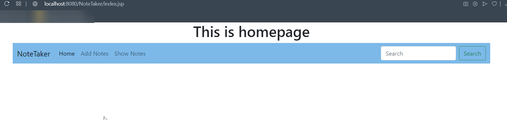
</p>

<p align="center">
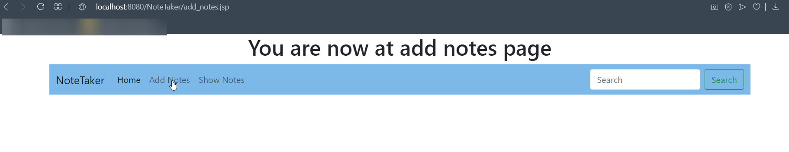
</p>

## Add Form in "Add Notes" page

We search form in bootsrap page and copy the form snippet and paste it in **add_notes.jsp**

So now it looks like this:

<p align="center">
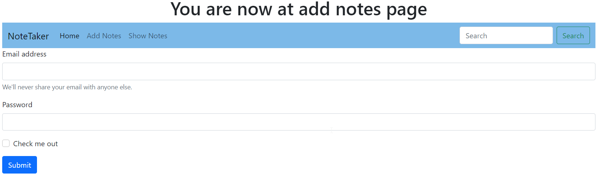
</p>

Now we change the form a bit to look like our add note form and change the form action `SaveNoteServelet` (This will handle the form data) and also update form method to `post`

So now it kind of looks like our desired page.

<p align="center">
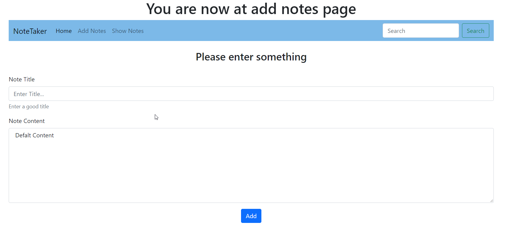
</p>

Now we add `required` keyword in our code so none of the field is empty when submitted.

## Adding SaveNoteServelet

So we right click on src/main/java and create a servelet named "SaveNoteServelet" in the "com.servelets" package. There were some error because we were using tomcat 10. It took several hours to figure out that tomcat 9 simply solves the problem. So we downgraded to tomcat 9.

We now edit the `doPost()` method which will capture our form contents(we also add `name` field in our form item to capture the values).

Now we run and see that we can capture the contents from the form.

Finally, we are gonna save the data into database by hibernate and to that we take the SingleTone SessionFactory and call `openSession()` method to get the session.

```java
Session session = FactoryProvider.getFactory().openSession();
```

And use this session to start our hibernate part (for details checkout HibernateTests project).

## Adding View All Notes Page

Now we create `all_notes.jsp` file for the page to show all notes and include `global_js_css.jsp` and `navbar.jsp` to get the initial look for our page.

<p align="center">
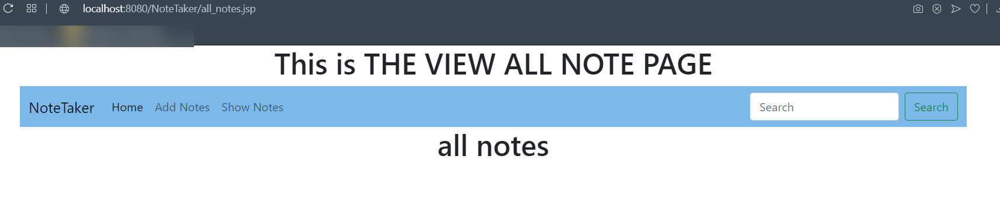
</p>


## Show Data on All Notes Page
Now we need to show all data on the page. We need to do that by incorporating java code into our `all_notes.jsp` page.

To do that we need to import important stuff by the following snippet at the top of `all_notes.jsp`

```Java
<%@ page import="java.util.List" %>
<%@ page import="com.helper.FactoryProvider" %>
<%@ page import="org.hibernate.Session" %>
<%@ page import="com.entitites.*" %>
<%@ page import="org.hibernate.Query" %>
```

and then we write the following snipee to fetch and print data.

```Java
<%
		Session s = FactoryProvider.getFactory().openSession();
		Query query = s.createQuery("From Note");
		List<Note> list = query.list();

		for (Note eachnote : list) {
			out.println(eachnote.getId() + " : " + eachnote.getTitle()+" -> "+eachnote.getContent()+"<br>");
		}
%>
```
**NOTE**: `Session session = FactoryProvider.getFactory().openSession();` gets a repeat variable error. I don't know why the case sensitivity is not working here.

So we can see a raw output in our view all notes page.

<p align="center">
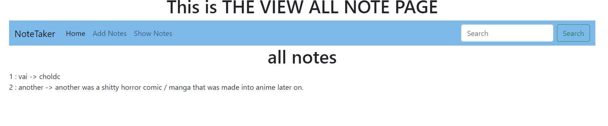
</p>


We add a bit bootstrap for visual appeal. (we used bootstrap card box template from the page and edited it a bit).

<p align="center">
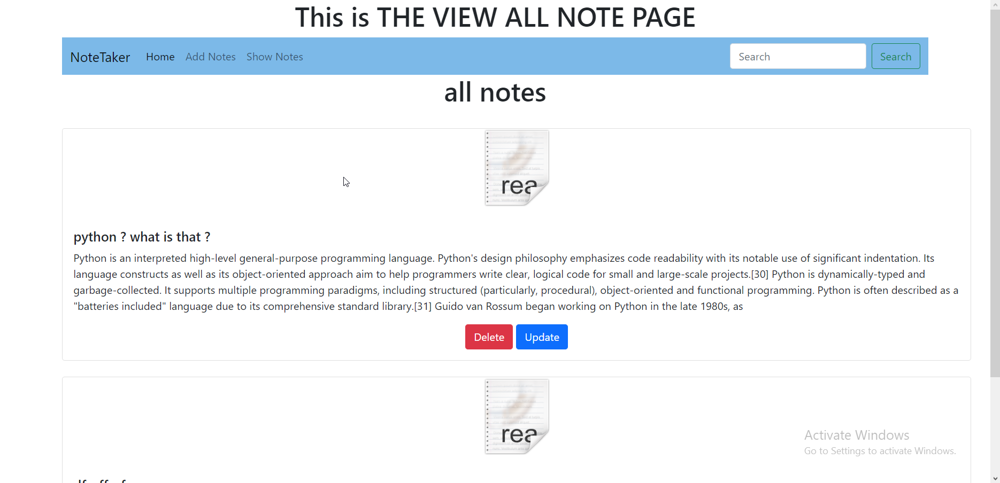
</p>

## Adding Delete Mechanism

To add delete mechanism we will add a link to a `DeleteServelet` with the delete button and since we need the id of the note to delete will also pass it to our servelet on a variable `note_id` by editing it like this : `DeleteServelet<note_id=<% note.getId() %>`

Now we create a servelet `DeleteServelet` by right clicking on src/main/java folder and then ***New->Servelet***. We keep the servelet under our **com.servelets** package.

Note that the benefit of creating servelet is that eclipse does the link mapping for us in the `web.xml` file in the **src/main/webapp/WEB-INF** directory by adding the following lines.
